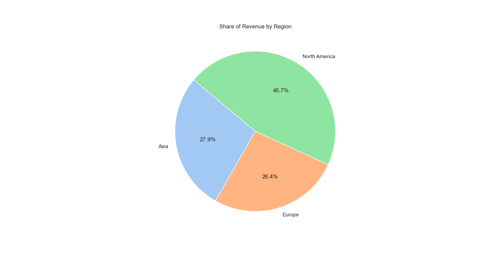

# 📊 Online Sales Data Analysis (Python)

## 📌 Executive Summary
Analyzed a dataset of **~$80,000 in sales transactions** using Python to uncover key revenue drivers and regional trends. The analysis focused on data cleaning (handling duplicate product entries), statistical correlation, and visualization to inform inventory and marketing strategies.

**Key Findings:**
* **Top Product:** The *MacBook Pro 16-inch* is the #1 revenue driver, significantly outperforming lower-cost high-volume items.
* **Regional Strategy:** *North America* dominates market share, suggesting ad spend should be focused there.
* **Pricing Insight:** A strong positive correlation (**0.93**) between Unit Price and Revenue confirms that high-ticket items drive growth more than volume.

---

## 🛠 Technologies Used
* **Python:** Main analysis
* **Pandas:** Data cleaning (merged duplicate "MacBook" records) & aggregation
* **Matplotlib / Seaborn:** Visualization
* **NumPy:** Statistical calculation (IQR for outlier detection)

---

## 📈 Visualizations & Insights

### 1. Revenue & Price Distribution
*Analyzed the spread of unit prices and order quantities. Most transactions are low-value volume orders, but revenue is driven by high-ticket outliers.*

### 2. Top 5 Best-Selling Products
*Identified the **MacBook Pro 16-inch** as the primary revenue driver, significantly outperforming high-volume/low-margin items.*

### 3. Regional Market Share
*North America dominates the sales distribution, suggesting that marketing ad spend should be prioritized in this region.*

### 4. Correlation Matrix (Price vs. Revenue)
*Discovered a **0.93 correlation** between Unit Price and Total Revenue. This validates a "Premium Pricing" strategy: selling fewer expensive items generates more revenue than selling many cheap items.*

---

## ⚙️ How to Run
1. Clone the repository
2. Install dependencies: `pip install pandas matplotlib seaborn`
3. Run the script: `python sales_analysis.py`
